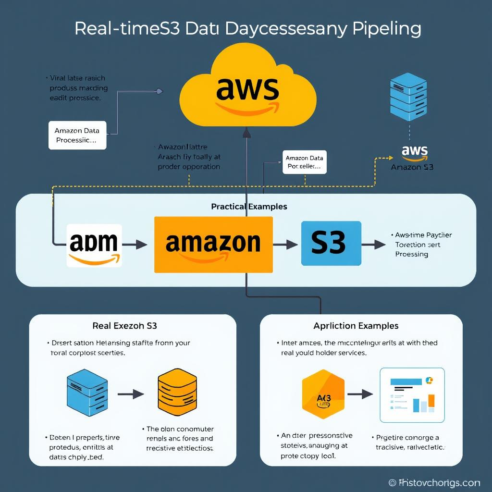

# aws-s3-real-time-processing
Exemplo prático de integração de serviços AWS para processamento de dados em tempo real a partir do Amazon S3
aws-s3-real-time-processing/
│
├── README.md
# Processamento de Dados do Amazon S3 em Tempo Real 🚀  

Este repositório demonstra como processar dados enviados para o Amazon S3 em tempo real, utilizando AWS Lambda, DynamoDB e Amazon QuickSight.  

## 🎯 Objetivos  
- Automatizar o processamento de arquivos no Amazon S3.
- Armazenar e analisar os dados em ferramentas integradas da AWS.
- Notificar equipes em tempo real sobre eventos importantes.

## 🔧 Tecnologias Utilizadas  
- **Amazon S3**: Para armazenamento de arquivos.
- **AWS Lambda**: Para processamento serverless.
- **Amazon DynamoDB**: Para armazenar dados processados.
- **Amazon SNS**: Para enviar notificações.
- **Amazon QuickSight**: Para relatórios e análises.

## 🚀 Fluxo do Sistema  
1. Arquivos são enviados para o Amazon S3.
2. O S3 dispara eventos para o AWS Lambda.
3. O Lambda processa os dados, armazena no DynamoDB ou envia notificações via SNS.
4. Dados são analisados no QuickSight.
   

## 📂 Organização  
- `/code`: Código da função Lambda.
- `/images`: Topologia do sistema.
- `/presentation`: Slides explicativos do projeto.

## 🛠️ Como Configurar  
1. Configure um bucket no Amazon S3.
2. Crie uma função Lambda com o código fornecido.
3. Integre o DynamoDB e configure o SNS para notificações.
4. Use o Amazon QuickSight para análise e relatórios.

Explore este repositório e implemente o sistema em seu ambiente! 😊

├── Imagem da Toplogia
│   └── topologia.jpg
├── /code
│   ├── lambda_function.py
│   └── requirements.txt
├── /presentation
│   └── apresentacao.pdf
